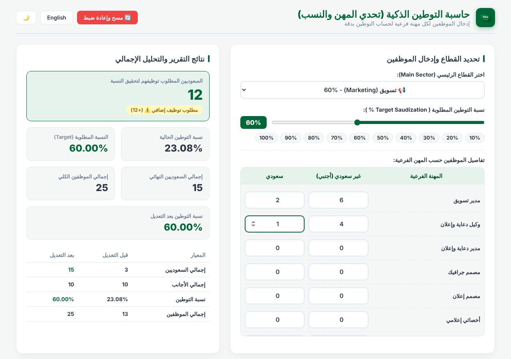

# Saudization Calculator · حاسبة التوطين

A small web tool that works out how many Saudi employees a company needs to hire to reach its Saudization (localization) target, broken down by profession.

**Live demo:** [cal-help.vercel.app](https://cal-help.vercel.app)



## What it does

1. Pick a sector (Engineering, Marketing, Sales, Project Management) or use a custom entry.
2. Set the target Saudization percentage with the slider or the 10%–100% presets.
3. Enter the number of Saudi and non-Saudi employees for each profession.
4. Read the result: the current rate, how many more Saudi hires are needed, and the rate after hiring them.

## Features

- Results update as you type
- Before / after comparison table
- Arabic and English interface, with right-to-left layout
- Dark and light themes
- No install and no dependencies: one HTML file

## How the number is calculated

For a target of `T`% and `F` non-Saudi employees, the Saudi headcount needed is:

```
required = ceil( T × F / (100 − T) )
```

The tool then subtracts the Saudi employees you already have to show how many more to hire.

Example: 10 non-Saudi and 3 Saudi employees with a 60% target → 15 Saudis required → **12 more to hire**.

## Run it locally

Download `index.html` and open it in a browser. That's all.

## Built with

HTML, CSS and vanilla JavaScript.

## Disclaimer

The sector percentages are presets built into this tool and may not match current regulations. Always confirm the required rates with the official Ministry of Human Resources and Social Development sources.
